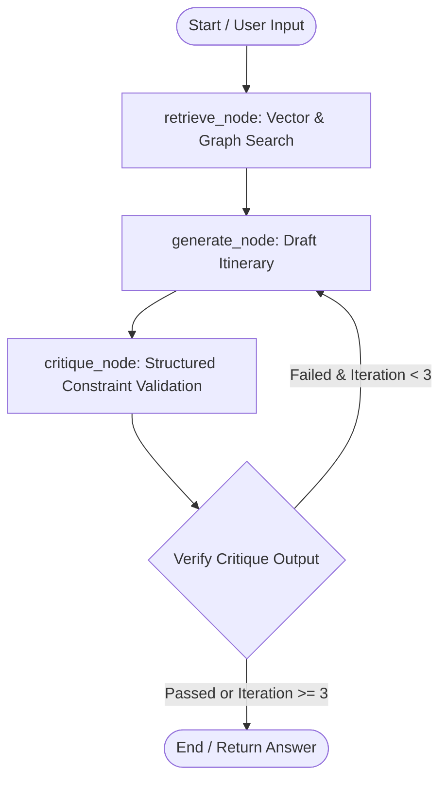

# Project Migration Report: Agentic Hybrid RAG Integration

This report reviews the status of the `AI_HYBRID_CHAT` project refactoring, mapping the implemented features against the goals defined in [plan.md](file:///c:/Users/sumit/Desktop/AI_HYBRID_CHAT/plan.md). It outlines what was accomplished, validates the architectural structure, and points out paths for future enhancement.

---

## 📊 Integration Checklist & Status

Here is the status of integration mapped directly to the four phases of the original migration plan:

### Phase 1: Codebase Audit & Structural Alignment
- [x] **Locate LLM Calls**: Found and refactored direct OpenAI completion calls in [rag_pipeline.py](file:///c:/Users/sumit/Desktop/AI_HYBRID_CHAT/src/packages/core_logic/rag_pipeline.py).
- [x] **Identify & Extract Prompts**: Isolated prompt strings and structured instructions, moving them into [prompts.py](file:///c:/Users/sumit/Desktop/AI_HYBRID_CHAT/src/packages/core_logic/prompts.py).
- [x] **Map Data Flow**: Codified the linear query pipeline into an agent state transition graph.
- [x] **Install Dependencies**: Added `langchain`, `langchain-openai`, and `langgraph` to [pyproject.toml](file:///c:/Users/sumit/Desktop/AI_HYBRID_CHAT/pyproject.toml) and successfully built the package workspace.

### Phase 2: LangChain Refactoring (LLM Agnostic)
- [x] **Model Factory**: Implemented `get_chat_model()` in [model_factory.py](file:///c:/Users/sumit/Desktop/AI_HYBRID_CHAT/src/packages/core_logic/model_factory.py). Models are configurable via environment variables (`CHAT_MODEL`) with sensible fallbacks.
- [x] **Prompt Refactoring**: Wrapped strings in `ChatPromptTemplate.from_messages` to handle conversation history placeholders and user/system instructions.
- [x] **Implement LCEL**: Re-coded context synthesis in [rag_pipeline.py](file:///c:/Users/sumit/Desktop/AI_HYBRID_CHAT/src/packages/core_logic/rag_pipeline.py#L75-L95) to utilize the pipe operator pipeline: `prompt | model | StrOutputParser()`.
- [x] **Test Linear Parity**: Verified that linear interfaces compile and run correctly once database contexts are supplied.

### Phase 3: LangGraph Orchestration (Cyclic Feedback Loop)
- [x] **Define State**: Created [state.py](file:///c:/Users/sumit/Desktop/AI_HYBRID_CHAT/src/packages/core_logic/state.py) outlining `AgentState` containing query inputs, history logs, search results, summaries, critiques, and response parameters.
- [x] **Build Nodes**: Implemented functional logic nodes in [nodes.py](file:///c:/Users/sumit/Desktop/AI_HYBRID_CHAT/src/packages/core_logic/nodes.py):
  - `retrieve_node`: Queries Pinecone + Neo4j and synthesizes a prompt-compatible summary.
  - `generate_node`: Generates a travel itinerary, automatically injecting criticism feedback if previous runs failed validation.
  - `critique_node`: Validates constraints (budget, multi-region logistical viability for short trips) using a secondary structured JSON LLM call.
- [x] **Routing Edges**: Built the StateGraph in [graph.py](file:///c:/Users/sumit/Desktop/AI_HYBRID_CHAT/src/packages/core_logic/graph.py) that routes control back to `generate_node` on failure, or terminates at `END` upon approval.

### Phase 4: Integration & Edge Cases
- [x] **Recursion Limits**: Configured execution calls in API and CLI to run with a step recursion limit config parameter `{"recursion_limit": 15}` to prevent runtime infinite loops.
- [x] **Update FastAPI Endpoints**: Updated [chat_service.py](file:///c:/Users/sumit/Desktop/AI_HYBRID_CHAT/src/api/app/v1/services/chat_service.py) to invoke the state graph (`app.ainvoke(...)`).
- [x] **Format Frontend Output**: Updated pydantic response schemas in [schemas/chat.py](file:///c:/Users/sumit/Desktop/AI_HYBRID_CHAT/src/api/app/v1/schemas/chat.py) to support the returning of conversational thread history.
- [x] **Clean Up**: Replaced legacy linear references with LangGraph invocations.

---

## 🏗️ System Architecture & Data Flow

Below is the state transition diagram representing the executed LangGraph control loop:



---

## 🔮 Future Improvements & Bug Fix Guidance

Here are recommended future enhancements and safety guardrails to implement:

### 1. Unified Embeddings Refactoring
* **Current Status**: While generation is LLM-agnostic (via `ChatOpenAI`), the vector search queries in `rag_pipeline.py` still invoke native OpenAI client methods (`clients.aclient.embeddings.create`).
* **Recommendation**: Refactor the embedding generator to use LangChain's `OpenAIEmbeddings` class, or create an embeddings factory similar to [model_factory.py](file:///c:/Users/sumit/Desktop/AI_HYBRID_CHAT/src/packages/core_logic/model_factory.py). This will ensure the entire pipeline is provider-agnostic.

### 2. Multi-Provider LLM Selector
* **Recommendation**: Extend [model_factory.py](file:///c:/Users/sumit/Desktop/AI_HYBRID_CHAT/src/packages/core_logic/model_factory.py) to parse an `LLM_PROVIDER` environment variable (e.g. `openai`, `anthropic`, or `ollama`) to dynamically instantiate different models, such as:
  ```python
  from langchain_anthropic import ChatAnthropic
  # dynamically return ChatOpenAI or ChatAnthropic based on config
  ```

### 3. Structured JSON Parsing Guardrails
* **Current Status**: The critique node parses raw text output as JSON. If the validator LLM hallucinates non-JSON formatting or wrappers, it catches the parsing exception and defaults to `passed=True` to prevent crashing.
* **Recommendation**: Implement `PydanticOutputParser` or use `.with_structured_output()` on the LLM instance to enforce strict JSON syntax natively at the provider API level.
