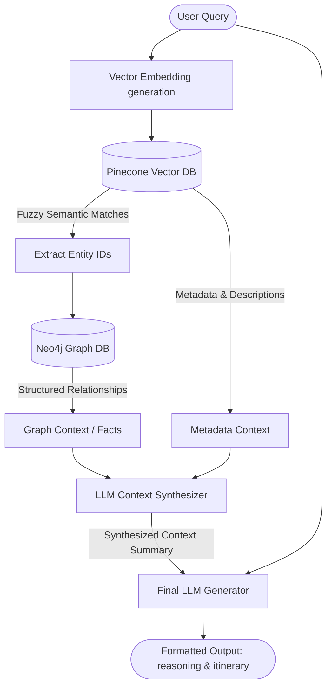

# AI Hybrid Chat - Project Steering Document

This document serves as an architectural guide and navigation map for the `AI_HYBRID_CHAT` project. Use this document to navigate the codebase, understand component relationships, and locate files and definitions.

---

## 🗺️ Codebase Map & Directory Structure

Here is the directory structure showing the roles of the main files:

* [plan.md](file:///c:/Users/sumit/Desktop/AI_HYBRID_CHAT/plan.md): The implementation plan detailing the stages of migration to an Agentic Hybrid RAG system.
* **`src/packages/core_logic/`**: The core package containing the business logic, client initializations, and RAG pipelines.
  * [__init__.py](file:///c:/Users/sumit/Desktop/AI_HYBRID_CHAT/src/packages/core_logic/__init__.py): Package initialization.
  * [config.py](file:///c:/Users/sumit/Desktop/AI_HYBRID_CHAT/src/packages/core_logic/config.py): Configuration manager. Loads environment variables from `.env`, exposes model configurations (e.g., `CHAT_MODEL = "gpt-4o-mini"`, `EMBED_MODEL = "text-embedding-3-small"`), and validates required keys.
  * [clients.py](file:///c:/Users/sumit/Desktop/AI_HYBRID_CHAT/src/packages/core_logic/clients.py): Handles setup and teardown for global database and API clients (AsyncOpenAI, Pinecone, Neo4j AsyncDriver, Upstash Redis).
  * [utils.py](file:///c:/Users/sumit/Desktop/AI_HYBRID_CHAT/src/packages/core_logic/utils.py): Utility functions for prompt/input text hashing (for caching), string truncation, client cleanup, and retry mechanisms for transient errors.
  * [llm_prompts.py](file:///c:/Users/sumit/Desktop/AI_HYBRID_CHAT/src/packages/core_logic/llm_prompts.py): Contains functions that build prompt templates for the LLM. It defines formatting instructions, output structures (using `<reasoning>` and `<itinerary>` tags), and chatbot history management.
  * [rag_pipeline.py](file:///c:/Users/sumit/Desktop/AI_HYBRID_CHAT/src/packages/core_logic/rag_pipeline.py): The main pipeline logic implementing the current linear Hybrid RAG flow:
    1. `embed_text`: Embeds text queries using OpenAI, cached via Upstash Redis.
    2. `pinecone_query`: Retrieves semantic matches from the Pinecone vector database.
    3. `fetch_graph_context`: Queries Neo4j for relationships related to the matching node IDs.
    4. `search_summary`: Summarizes the retrieved vector context and graph context.
    5. `call_chat`: Sends final prompt with history and RAG context to OpenAI.
* **`src/cli/`**: Entrypoint for interactive CLI-based chat.
  * [main.py](file:///c:/Users/sumit/Desktop/AI_HYBRID_CHAT/src/cli/main.py): CLI interface that initializes clients and runs an interactive loop for querying the RAG pipeline directly in the console.
* **`src/api/app/`**: FastAPI backend exposing the API routes.
  * [main.py](file:///c:/Users/sumit/Desktop/AI_HYBRID_CHAT/src/api/app/main.py): Main FastAPI app setup, CORS middleware registration, and lifespan hooks that execute client setup/shutdown.
  * **`v1/`**: API Version 1 endpoints, schemas, and services.
    * [routes/chat.py](file:///c:/Users/sumit/Desktop/AI_HYBRID_CHAT/src/api/app/v1/routes/chat.py): API Router mapping POST `/api/v1/chat` to `ChatService`.
    * [schemas/chat.py](file:///c:/Users/sumit/Desktop/AI_HYBRID_CHAT/src/api/app/v1/schemas/chat.py): Pydantic input/output schemas (`ChatRequest` and `ChatResponse`).
    * [services/chat_service.py](file:///c:/Users/sumit/Desktop/AI_HYBRID_CHAT/src/api/app/v1/services/chat_service.py): Service class executing the hybrid RAG flow on API requests, returning response schemas and managing history length.
* **`scripts/`**: One-off data ingestion and database setup utilities.
  * `load_to_neo4j.py`: Script to populate the Neo4j Graph DB with nodes and edges from raw travel datasets.
  * `pinecone_upload.py`: Script to generate embeddings and upload travel context to Pinecone.
* **`data/`**: Datasets containing geographical, travel, and attraction metadata.
  * `vietnam_travel_dataset.json`: Raw travel database used for ingestion.

---

## 🔄 Core Data Flow: Linear RAG (Current State)

---

## 🛠️ Key Interfaces & Shared States

### Clients Setup
Global client variables are declared in [clients.py](file:///c:/Users/sumit/Desktop/AI_HYBRID_CHAT/src/packages/core_logic/clients.py) and initialized asynchronously via `setup_clients()`. Both FastAPI (`lifespan`) and the CLI invocation call these:
- `clients.aclient` -> `openai.AsyncOpenAI` instance.
- `clients.pc` -> `pinecone.Pinecone` instance.
- `clients.aredis` -> `upstash_redis.asyncio.Redis` instance.
- `clients.index` -> Pinecone Index connection.
- `clients.driver` -> `neo4j.AsyncDriver` database driver.

### Current RAG Implementation
Defined inside [rag_pipeline.py](file:///c:/Users/sumit/Desktop/AI_HYBRID_CHAT/src/packages/core_logic/rag_pipeline.py):
- `embed_text(text: str) -> List[float]`
- `pinecone_query(query_text: str, top_k: int) -> List[Dict]`
- `fetch_graph_context(node_ids: List[str]) -> List[Dict]`
- `search_summary(user_query: str, matches: List[Dict], facts: List[Dict]) -> str`
- `call_chat(prompt_messages: List[Dict]) -> str`

---

## 🎯 Implementation Roadmap (Refactoring Goals)

We will follow the guidelines in [plan.md](file:///c:/Users/sumit/Desktop/AI_HYBRID_CHAT/plan.md) to migrate this linear flow to a LangChain and LangGraph-based feedback loop:

1. **LLM Agnostic Transition (LangChain)**
   - Introduce LangChain adapters to replace direct OpenAI calls.
   - Build a central Model Factory inside `core_logic` for model generation.
   - Externalize prompts into structured message templates.
2. **Stateful Graph Loop (LangGraph)**
   - Formulate a cyclical workflow: `Retrieve -> Generate -> Critique`.
   - Setup conditional paths checking itinerary constraints (e.g. routing back to Generate on failed critiques).
   - Enforce safety recursion limits (e.g. max 3 loops).
3. **Integration**
   - Connect FastAPI and CLI to invoke the Compiled StateGraph instead of direct sequential method calls.
